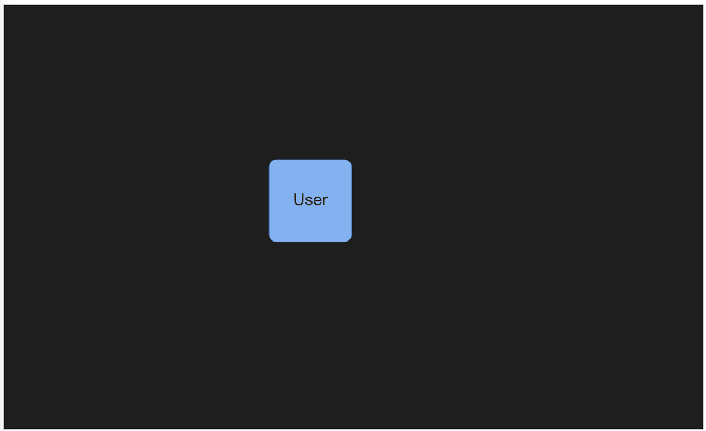
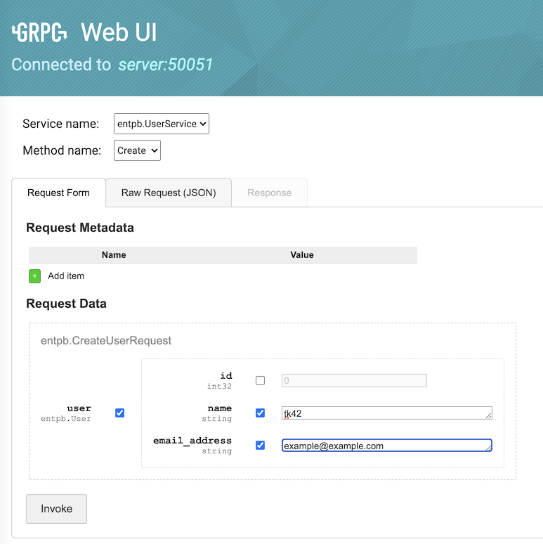
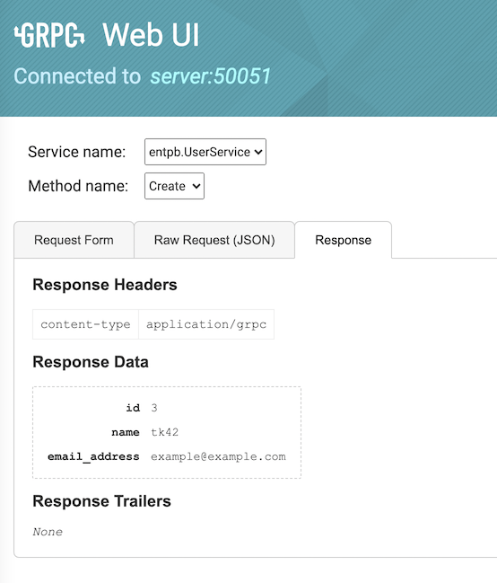
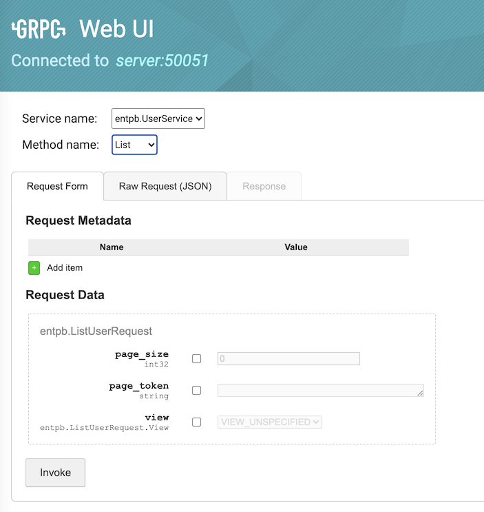
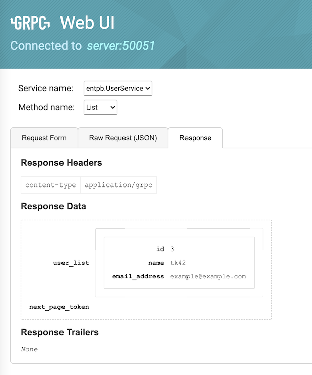
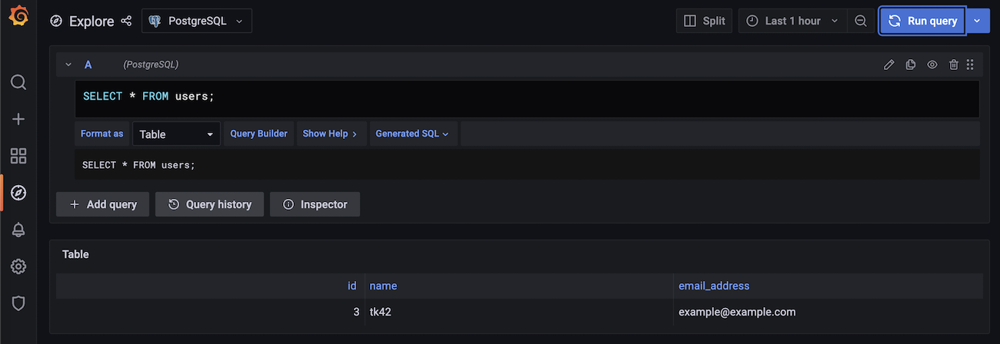

# cache-backend-template

Highly ease of maintenance gRPC cache backend template with Postgres and visualized by grafana and entviz

Keywords: golang, ent., postgres, gRPC

## Requirements

Go >= 1.18

## How to start

Mainly follow [this tutorial](https://entgo.io/docs/grpc-intro/)

### Create entity

In this example, create User entity

```
go run -mod=mod entgo.io/ent/cmd/ent init User
go install entgo.io/contrib/entproto@latest
```

To define User schema, open ent/schema/user.go. then

```
go generate ./...
```

Now you can see the ER diagram with entviz to see `schema-viz.html`



### Generate proto files

```
go get entgo.io/contrib/entproto
```

and add Annotations in schema/user.go

```
func (User) Fields() []ent.Field {
	return []ent.Field{
		field.String("name").
			Unique().
			Annotations(  // added here !
				entproto.Field(2),
			),
		field.String("email_address").
			Unique().
			Annotations(
				entproto.Field(3),
			),
	}
}

func (User) Edges() []ent.Edge {
	return nil
}


func (User) Annotations() []schema.Annotation {
	return []schema.Annotation{
		entproto.Message(),
        entproto.Service(), // to add gRPC services
	}
}
```

and add directive line at the last in generate.go, like following

```
package ent

//go:generate go run -mod=mod entgo.io/ent/cmd/ent generate ./schema
//go:generate go run -mod=mod entgo.io/contrib/entproto/cmd/entproto -path ./schema  // added here!
```

then

```
docker compose -f docker-compose.protoc.yml up
```

you would get `entpb_user_service.go`

### Create a gRPC server

Write `main.go`. Note that in main.go the server use reflection API

```
reflection.Register(server)
```

Then launch postgres DB and grafana etc...

```
$ docker compose up
```

## Screen shots

Create a user



Response of the creation of a user



Get list of user



Response of the list of user



Check the data inside postgres DB



## Reference

- [How I use Postgres with Go](https://jbrandhorst.com/post/postgres/)
- [grpc-postgres](https://github.com/johanbrandhorst/grpc-postgres)
- [ent の Protocol Buffers スキーマと gRPC サービスのコード生成機能を試したみた](https://zenn.dev/unm/articles/f73b2ae3a4b4c7)
